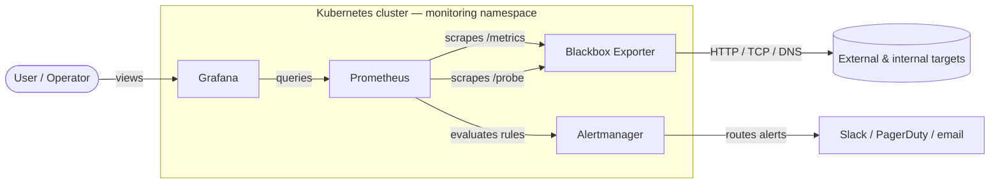

# kubernetes_blackbox_exporter

[](LICENSE)
[](https://github.com/prometheus/blackbox_exporter/releases/tag/v0.28.0)
[](https://kubernetes.io/)

Production-aware Kubernetes manifests for [prom/blackbox-exporter](https://github.com/prometheus/blackbox_exporter), with alerts, runbooks, and a Grafana dashboard included.

## What & why

Blackbox Exporter probes endpoints over HTTP, HTTPS, TCP, ICMP, and DNS, then exposes the result as Prometheus metrics. It complements metrics emitted from inside your applications (Prometheus client libraries, USE/RED dashboards) with outside-in checks — the same view your users get.

Use this repo as a starting point for adding synthetic / blackbox monitoring to a Prometheus stack on Kubernetes. The manifests harden the upstream image (non-root, dropped capabilities, resource bounds, network policy), the alerts cover the common failure modes, and the dashboard makes the results legible.

## Architecture



More detail in [docs/architecture.md](docs/architecture.md).

## Choose your path

How you wire Prometheus to the exporter depends on whether you run [prometheus-operator](https://github.com/prometheus-operator/prometheus-operator) (e.g. kube-prometheus-stack):

| If you have…                                            | Apply…                                                                  | And the alerts work via… |
| ------------------------------------------------------- | ----------------------------------------------------------------------- | ------------------------ |
| `monitoring.coreos.com` CRDs (operator)                 | All files in `manifests/`                                               | `manifests/07-prometheusrule.yaml` |
| Plain Prometheus with a static `prometheus.yml`         | `manifests/00..05` (skip the ServiceMonitor / PrometheusRule)           | Merge alerts into your existing rules file |

Check with: `kubectl api-resources | grep monitoring.coreos.com`.

## Prerequisites

- A Kubernetes cluster (1.24+ tested).
- A `monitoring` namespace (or another; adjust the manifests' `metadata.namespace`).
- Prometheus and Grafana already installed in that namespace.

## Quick start

```bash
# Create the namespace if you don't already have one.
kubectl create namespace monitoring --dry-run=client -o yaml | kubectl apply -f -

# Apply the manifests.
kubectl apply -f manifests/ -n monitoring

# Wait for the rollout.
kubectl -n monitoring rollout status deployment/blackbox-exporter
```

If you are on the non-operator path, also merge `prometheus/scrape-config-example.yaml` into your Prometheus configuration and restart Prometheus.

## Wiring Prometheus

### Operator path

`manifests/06-servicemonitor.yaml` ships two resources:

- A **ServiceMonitor** that scrapes the exporter's own `/metrics` (job `blackbox-exporter`).
- A **Probe** custom resource that drives `/probe` against a curated list of external URLs (job `blackbox`). Edit the `staticConfig.static` list in that file to point at your targets.

> **Important:** kube-prometheus-stack's Prometheus typically selects ServiceMonitors and Probes by a `release: <chart-release-name>` label. If your resources are silently ignored, add that label and re-apply.

### Non-operator path

See [prometheus/scrape-config-example.yaml](prometheus/scrape-config-example.yaml). It defines two jobs (`blackbox-exporter` and `blackbox`) using the standard relabel chain. Merge into your existing `scrape_configs:` and restart Prometheus:

```bash
kubectl rollout restart deployment <prometheus-deployment> -n monitoring
```

## Verification

```bash
# Pods healthy
kubectl -n monitoring get pods -l app.kubernetes.io/name=blackbox-exporter

# Reach the exporter UI locally
kubectl -n monitoring port-forward svc/blackbox-exporter 9115:9115

# In another shell, run a probe manually
curl -s 'http://localhost:9115/probe?target=https://example.com&module=http_2xx' \
  | grep -E '^probe_success'
# Expect: probe_success 1
```

You can also visit `http://localhost:9115` in a browser for the exporter's built-in UI (lists modules and recent probes).

## Probe modules

The shipped `ConfigMap` (`manifests/02-configmap.yaml`) provides:

| Module          | Use case                                                                  |
| --------------- | ------------------------------------------------------------------------- |
| `http_2xx`      | HTTP GET, expect 2xx (default for most websites and APIs).                |
| `http_post_2xx` | HTTP POST with empty body (liveness endpoints that require POST).         |
| `tcp_connect`   | Plain TCP connect (databases, queues, anything non-HTTP).                 |
| `dns_udp`       | DNS A-record lookup over UDP (validates a resolver or DNS server).        |

`icmp` is intentionally omitted — see [Enabling ICMP](#enabling-icmp).

## Alerts

`manifests/07-prometheusrule.yaml` defines six alerts:

| Alert                              | Severity | When it fires                                                   |
| ---------------------------------- | -------- | --------------------------------------------------------------- |
| `BlackboxProbeFailing`             | critical | `probe_success == 0` for 5m                                     |
| `BlackboxProbeSlowHttp`            | warning  | `probe_duration_seconds{job="blackbox"} > 1` for 10m            |
| `BlackboxSslCertExpiringSoon`      | warning  | TLS cert expires within 14 days                                 |
| `BlackboxSslCertExpiringCritical`  | critical | TLS cert expires within 3 days                                  |
| `BlackboxExporterDown`             | critical | `up{job="blackbox-exporter"} == 0` for 5m                       |
| `BlackboxProbeHttpFailure`         | warning  | `probe_http_status_code` outside 200–399 for 5m                 |

Each alert carries a `runbook_url` pointing to a runbook in [docs/runbooks/](docs/runbooks/).

## Grafana dashboard

Import [`grafana/blackbox-dashboard.json`](grafana/blackbox-dashboard.json):

1. Grafana → Dashboards → New → Import.
2. Upload the JSON file.
3. Select your Prometheus datasource when prompted.

Panels:

- Probe success / duration / status code (current state).
- Probe success over time.
- HTTP phase breakdown (`resolve` / `connect` / `tls` / `processing` / `transfer`) — the panel that turns "the probe is slow" into "TLS handshake is slow".
- TLS certificate days remaining.
- Exporter health (`up{job="blackbox-exporter"}`).

## Security notes

The Deployment ships locked down by default:

- Runs as non-root (uid/gid 65534, `nobody`).
- `readOnlyRootFilesystem: true`, `allowPrivilegeEscalation: false`.
- All Linux capabilities dropped (`capabilities.drop: [ALL]`).
- `seccompProfile.type: RuntimeDefault`.
- Dedicated ServiceAccount with `automountServiceAccountToken: false`.
- `NetworkPolicy` restricts ingress on port 9115 to Prometheus pods and constrains egress to DNS plus the public internet (minus RFC1918 / loopback / link-local) plus explicit in-cluster CIDRs.

### Enabling ICMP

The ICMP prober requires `CAP_NET_RAW`, which conflicts with dropping all capabilities. To enable it, edit `manifests/03-deployment.yaml`:

```yaml
securityContext:
  allowPrivilegeEscalation: false
  readOnlyRootFilesystem: true
  capabilities:
    drop:
      - ALL
    add:
      - NET_RAW           # required for ICMP
```

Then add an `icmp` module to the ConfigMap:

```yaml
icmp:
  prober: icmp
  timeout: 5s
  icmp:
    preferred_ip_protocol: "ip4"
```

You can keep `runAsNonRoot: true` — modern kernels honour `CAP_NET_RAW` for non-root users — but some older kernels require `runAsUser: 0`. Test on your distribution.

## Versioning and image policy

The exporter image is pinned to a specific minor version (currently `v0.28.0`). Bump quarterly or when upstream ships a security fix; do not use `:latest` (reproducible deploys matter more than the convenience).

Check the latest stable release at <https://github.com/prometheus/blackbox_exporter/releases>.

## Local commands

A small `Makefile` wraps the day-to-day operations:

```bash
make apply           # kubectl apply -f manifests/
make port-forward    # kubectl port-forward svc/blackbox-exporter 9115:9115
make probe           # curl /probe and assert probe_success 1
make validate        # kubeconform -strict (requires kubeconform installed)
```

Override the namespace with `make apply NS=observability`.

## Troubleshooting

**ServiceMonitor / Probe / PrometheusRule is silently ignored.**
kube-prometheus-stack selects user-defined resources by a `release: <chart>` label. Add it under `metadata.labels` on the resource and re-apply.

**`endpoints` for the Service is empty.**
The Service selector does not match any pod labels. After the relabeling done in this release, both should use `app.kubernetes.io/name=blackbox-exporter, app.kubernetes.io/component=exporter`. Confirm with `kubectl -n monitoring get endpoints blackbox-exporter`.

**Probe metrics carry the exporter's IP as `instance`, not the target URL.**
The relabel chain is wrong. The minimal chain is: `__address__ -> __param_target`, `__param_target -> instance`, then rewrite `__address__` to the exporter's address. See [prometheus/scrape-config-example.yaml](prometheus/scrape-config-example.yaml) for a working example.

**`probe_success` is `1` but the page is broken.**
The module's `valid_status_codes` may be too permissive. Tighten the list, or layer on a `BlackboxProbeHttpFailure` alert (already shipped).

**NetworkPolicy is blocking probes.**
If you probe targets via in-cluster service DNS, confirm the destination's pod / namespace is reachable via the egress rules in `manifests/05-networkpolicy.yaml`. The shipped policy explicitly lists in-cluster CIDRs — adjust if your cluster uses a non-default pod CIDR.

## Running on Minikube + EC2

If you are following the original deployment story (Minikube on an EC2 instance, accessed from a laptop via SSH port-forwarding), see [docs/ec2-minikube-appendix.md](docs/ec2-minikube-appendix.md).

## License

[MIT](LICENSE) © 2026 Yash Yadav.
