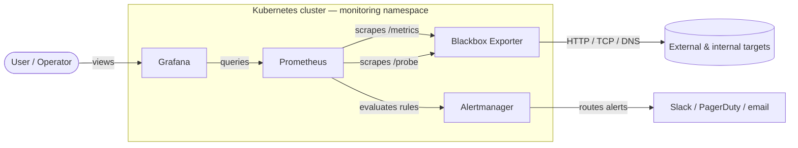

# Architecture

This document describes how the blackbox exporter fits into a Prometheus monitoring stack on Kubernetes.

## How probes work

The blackbox exporter exposes two HTTP endpoints:

- **`/metrics`** — its own runtime metrics (Go GC, build info, scrape success counts). Prometheus scrapes this like any normal exporter; results carry `job="blackbox-exporter"`.
- **`/probe`** — accepts a `target` query parameter and a `module` parameter, performs the probe synchronously, and returns the result as Prometheus metrics. Prometheus uses relabeling to turn a list of target URLs into `/probe?target=<URL>` requests; results carry `job="blackbox"` (the conventional name used by this repo's ServiceMonitor / Probe / scrape config / alerts).

The metrics from `/probe` carry an `instance` label set to the probed URL (not the exporter pod), which is what makes it possible to write alerts and dashboards by target.

## Why probe-based monitoring

Metrics emitted from inside an application tell you what *the application thinks* is happening. Black-box probes from outside tell you what *users see*. Both are needed: a healthy in-app `request_count` metric is meaningless if a load balancer between the user and the app is dropping connections.

This repo gives you the outside-in half of that picture.
